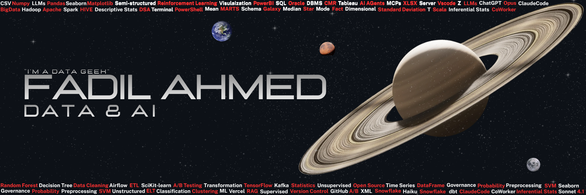

## Hey Visitor!,

I work across the full data stack: building the pipelines, modelling on top of them, and turning the results into decisions people act on. I've got my hands dirty with data — and I genuinely enjoy the puzzle of connecting different tools into something that works.

  

## **Let's Connect**

---

## Tech Stack

**Languages & Querying**

**Data Engineering & Big Data**

**Machine Learning**

**Databases**

**Cloud & Infrastructure**

**Visualization**

