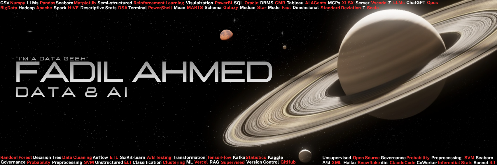

# Fadil Ahmed

**Data Engineer / Data Scientist** — I build pipelines that don't break and models that actually ship.

<!-- Replace the two lines below with your real specifics. This is the part recruiters read. -->
Currently working on `<what you're building — e.g. large-scale ETL on AWS, forecasting models, LLM apps>` at `<Company>`.
Interested in distributed data processing, ML in production, and making analytics fast enough to be useful.

📍 Bengaluru, India &nbsp;·&nbsp; 📫 [fadilahmed.mitblr@gmail.com](mailto:fadilahmed.mitblr@gmail.com)

---

## Featured Work

<!-- Swap in your 3-4 strongest repos. Lead with impact/scale, not tooling. -->

| Project | What it does | Stack |
|---|---|---|
| **[Project Name](link)** | One line on the problem and the outcome — e.g. "Streaming pipeline processing 2M events/day with sub-minute latency." | Kafka · Spark · Airflow |
| **[Project Name](link)** | e.g. "Demand forecasting model that cut inventory error by 18%." | Python · XGBoost · MLflow |
| **[Project Name](link)** | e.g. "End-to-end RAG system over 50k internal documents." | LangChain · FAISS · FastAPI |

---

## Tech Stack

**Languages & Querying**

**Data Engineering & Big Data**

**Machine Learning**

**Databases**

**Cloud & Infrastructure**

**Visualization**

---

## Writing & Notebooks

<!-- Optional but high-signal for data roles. Delete if you don't have these yet. -->
- [Notebook or blog post title](link) — one line on what it covers
- [Notebook or blog post title](link) — one line on what it covers

---

<!-- Replace YOUR_USERNAME with your actual GitHub handle in all three URLs below. -->

